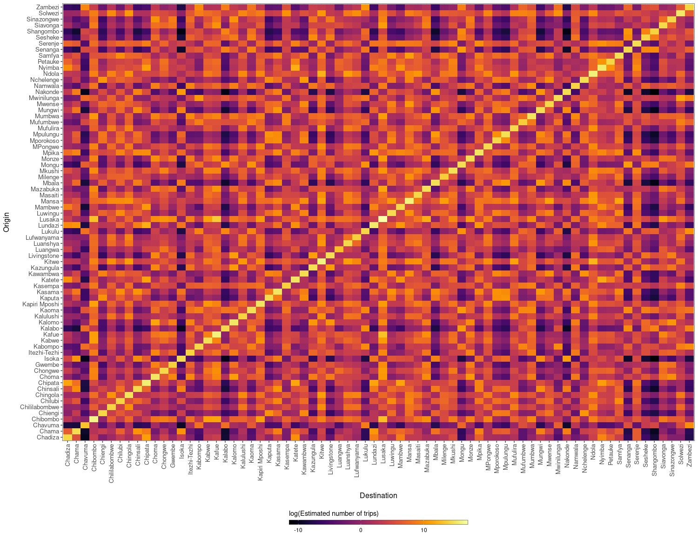

<!-- README.md is generated from README.Rmd. Please edit that file -->
<!-- badges: start -->

[](https://github.com/OJWatson/nomad/actions)
[](https://www.codefactor.io/repository/github/OJWatson/nomad)
[](https://codecov.io/github/OJWatson/nomad?branch=main)
[](https://github.com/afyac/mast/actions/workflows/R-CMD-check.yaml)
<!-- badges: end -->

## 

## Mobility modelling for infetious disease epidemiology

### Installation

To install `nomad`:

``` r
remotes::install_github("OJWatson/nomad", upgrade = FALSE)
```

### Demonstration

Most users will come to use `nomad` with a shape file for which they
want mobility predictions.

``` r
# Get our shape object. Here let's use the MAP Zambia Admin 2
zmbsf <- malariaAtlas::getShp(ISO = "ZMB", admin_level = c("admin2")) %>% 
  sf::st_as_sf()
```

For our given shape file, we need to fetch population sizes, which
`nomad` makes easy by wrapping WorldPop

    # Use the inbuilt population fetch functions in nomad
    pop <- nomad::get_pop("ZMB", 2020)

Next we need to unpack this to create population sizes for our regions

    # And unpack the population based on our shape file
    pop_extract <- nomad::unpack_pop(zmbsf, pop)

    # Calculate our population per region
    sum <- pop_extract %>%
      dplyr::select(iso, name_2, pop) %>%
      tidyr::unnest(cols = c(pop)) %>%
      tidyr::drop_na() %>%
      group_by(name_2) %>% 
      dplyr::summarise(pop = round(sum(pop)))

From here we can create the distance matrix and the population sizes

``` r
# Now we can create our vector of population sizes needed to predict
N <- sum %>% pull(pop) %>% setNames(sum$name_2)
N <- N[order(names(N))]

# And also create our distance matrix of population sizes needed to predict
# N.B The coversion from degrees to metres
centroids <- sf::st_centroid(zmbsf) %>% sf::st_coordinates()
D <- mobility::get_distance_matrix(
  x = centroids[,"X"], 
  y = centroids[,"Y"], 
  id = zmbsf$name_2)*113.5*1000 
```

Now we can use a selected model from the `nomad` model database:

``` r
# Having selected our most suitable model having looked at the model database
# https://ojwatson.github.io/nomad/articles/model.html
mod <- nomad::model_db$zmb_cdr_2020_mod_dd_exp

# Predict mobility model using new data
M_hat <- predict(object=mod, newdata=list(D = D, N = N))

# And now we can plot our predictions as needed for our own work
ggplot(data=reshape2::melt(M_hat)) +
  geom_tile(aes(x=factor(destination),
                y=factor(origin),
                fill=log(value))) +
  xlab('Destination') + ylab("Origin") +
  theme_bw() + theme(axis.text.x=element_text(size=10),
                     axis.text.y=element_text(size=10),
                     axis.title.x=element_text(size=12, margin = margin(t = 15)),
                     axis.title.y=element_text(size=12, margin = margin(r = 15)),
                     legend.position='bottom') +
  viridis::scale_fill_viridis(option='inferno', 
                              direction=1) +
  guides(fill=guide_colorbar(title='log(Estimated number of trips)',
                             title.position='top',
                             label.theme=element_text(size=9),
                             barwidth=20,s
                             barheight=0.5,
                             frame.colour='black',
                             ticks=TRUE)) +
  theme(axis.text.x = element_text(angle = 90, hjust = 1, vjust = 0.5))
```



#### Licenses

Code: [MIT](http://opensource.org/licenses/MIT) year: 2023, copyright
holder: OJ Watson

Data: [CC-0](http://creativecommons.org/publicdomain/zero/1.0/)
attribution requested in reuse
