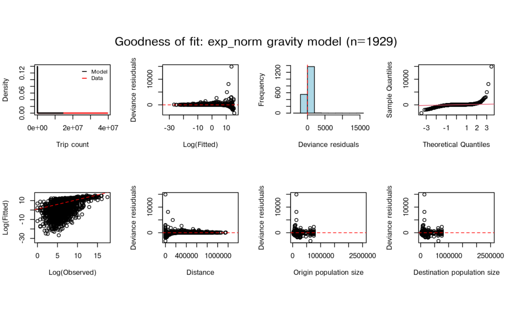

# Introduction

`nomad` stores fitted mobility models for infectious disease modelling.
The usual workflow is:

1.  identify a plausible source mobility dataset;
2.  inspect the fitted models available for that dataset;
3.  prepare a distance matrix and population vector for the prediction
    setting;
4.  predict a mobility matrix;
5.  check warnings and sensitivity to alternative models.

``` r

library(nomad)
```

## Available Data And Models

The mobility catalogue describes the source datasets used to fit models
in the package. It is the first thing to check because a model fitted to
the wrong country, period, or spatial scale can be more misleading than
helpful.

``` r

mobility_table()
```

    #> # A tibble: 56 × 14
    #>    name    country date_start date_end         n type  sampling_scheme censoring
    #>    <chr>   <chr>   <date>     <date>       <dbl> <chr> <chr>           <chr>    
    #>  1 ken_cd… KEN     2008-06-01 2009-07-03 8.48e10 call… 100% of leadin…  NA      
    #>  2 nam_cd… NAM     2010-10-02 2014-04-30 1.84e 9 call… 100% of leadin… "Two dis…
    #>  3 bfa_cd… BFA     2016-01-01 2016-12-31 3.77e 7 call… 1.4% random se…  NA      
    #>  4 zmb_cd… ZMB     2020-08-01 2020-12-30 1.12e 8 call… 100% of leadin…  NA      
    #>  5 zmb_fb… ZMB     NA         NA         9.53e 6 face… NA               NA      
    #>  6 ago_fb… AGO     2024-07-29 2025-06-16 3.98e 8 face… Facebook Activ… "<10 tri…
    #>  7 bdi_fb… BDI     2024-07-29 2025-06-16 3.03e 7 face… Facebook Activ… "<10 tri…
    #>  8 ben_fb… BEN     2024-07-29 2025-06-16 7.99e 7 face… Facebook Activ… "<10 tri…
    #>  9 bfa_fb… BFA     2024-07-29 2025-06-16 1.15e 8 face… Facebook Activ… "<10 tri…
    #> 10 bwa_fb… BWA     2024-07-29 2025-06-16 2.85e 7 face… Facebook Activ… "<10 tri…
    #> # ℹ 46 more rows
    #> # ℹ 6 more variables: aggregation <chr>, publication <chr>,
    #> #   has_fitted_models <lgl>, prediction_period_days <dbl>, distance_unit <chr>,
    #> #   provenance <chr>

Check `has_fitted_models` before selecting a dataset: some catalogue
entries are awaiting data and have no model yet. The model catalogue
below lists the actual fitted variants, along with their source metadata
and fit statistics.

``` r

model_table(country = "ZMB")
```

    #> # A tibble: 14 × 27
    #>    name      data_name mobility_model model_type hierarchical max_rhat min_n_eff
    #>    <chr>     <chr>     <chr>          <chr>      <lgl>           <dbl>     <dbl>
    #>  1 zmb_cdr_… zmb_cdr_… departure-dif… exp        FALSE            1.01      1239
    #>  2 zmb_fb_2… zmb_fb_2… gravity        exp        FALSE            1.01         2
    #>  3 zmb_fb_2… zmb_fb_2… departure-dif… exp        FALSE            1.01       655
    #>  4 zmb_fb_2… zmb_fb_2… departure-dif… power      FALSE            1.01       587
    #>  5 zmb_fb_2… zmb_fb_2… departure-dif… radiation  FALSE            1.01      1060
    #>  6 zmb_fb_2… zmb_fb_2… gravity        basic      FALSE            1            0
    #>  7 zmb_fb_2… zmb_fb_2… gravity        exp        FALSE            1.05         3
    #>  8 zmb_fb_2… zmb_fb_2… gravity        exp_norm   FALSE            1.01       801
    #>  9 zmb_fb_2… zmb_fb_2… gravity        power      FALSE            1.55         3
    #> 10 zmb_fb_2… zmb_fb_2… gravity        power_norm FALSE            1          804
    #> 11 zmb_fb_2… zmb_fb_2… gravity        scaled_po… FALSE            1.03        66
    #> 12 zmb_fb_2… zmb_fb_2… gravity        transport  FALSE            1            0
    #> 13 zmb_fb_2… zmb_fb_2… radiation      basic      FALSE           NA           NA
    #> 14 zmb_fb_2… zmb_fb_2… radiation      finite     FALSE           NA           NA
    #> # ℹ 20 more variables: rhat_above_1_1 <lgl>, supports_newdata <lgl>,
    #> #   supports_stochastic_draws <lgl>, DIC <dbl>, RMSE <dbl>, MAPE <dbl>,
    #> #   R2 <dbl>, country <chr>, date_start <date>, date_end <date>, n <dbl>,
    #> #   data_type <chr>, sampling_scheme <chr>, censoring <chr>, aggregation <chr>,
    #> #   publication <chr>, has_fitted_models <lgl>, prediction_period_days <dbl>,
    #> #   distance_unit <chr>, provenance <chr>

## Inspect A Model

The model profile summarises the scale and period of the source data.
This is the quickest way to check whether a model is plausible for a
prediction task.

``` r

model <- model_db$zmb_fb_2025_mod_grav_exp_norm
model_profile(model)
```

    #> # A tibble: 1 × 27
    #>   name  data_name country aggregation date_start date_end   source_duration_days
    #>   <chr> <chr>     <chr>   <chr>       <date>     <date>                    <dbl>
    #> 1 zmb_… zmb_fb_2… ZMB     admin_2     2024-07-29 2025-06-16                   21
    #> # ℹ 20 more variables: prediction_period_days <dbl>, distance_unit <chr>,
    #> #   supports_newdata <lgl>, supports_stochastic_draws <lgl>, n_origin <int>,
    #> #   n_dest <int>, distance_min <dbl>, distance_q25 <dbl>,
    #> #   distance_median <dbl>, distance_q75 <dbl>, distance_max <dbl>,
    #> #   population_total <dbl>, population_min <dbl>, population_median <dbl>,
    #> #   population_max <dbl>, max_rhat <dbl>, min_n_eff <dbl>,
    #> #   rhat_above_1_1 <lgl>, has_mobility_data <lgl>, has_saved_check <lgl>

Model-check statistics and plots are available even when the underlying
private mobility matrix cannot be bundled.

``` r

check(model, plots = FALSE)
```

    #> $DIC
    #> [1] NA
    #> 
    #> $RMSE
    #> [1] 965441.9
    #> 
    #> $MAPE
    #> [1] 32.18002
    #> 
    #> $R2
    #> [1] 0.1056686

``` r

plot(model)
```



## Prepare A Small Prediction Setting

Predictions use the same data structure as `mobility::predict()`: a
distance matrix `D` and either one population vector `N` or
origin/destination vectors `N_orig` and `N_dest`.

Here we make a small, named toy setting. The values are not intended to
be real Zambia data; they are just enough to show the shape of a
prediction request.

Show how to construct the example regions

``` r

places <- data.frame(
  name = c("Lusaka", "Kabwe", "Ndola", "Kitwe", "Livingstone"),
  x = c(0, 1.2, 2.8, 2.6, -1.4),
  y = c(0, 1.0, 2.7, 2.4, -2.7),
  population = c(2500000, 230000, 475000, 690000, 170000)
)

D <- as.matrix(dist(places[, c("x", "y")])) * 120
dimnames(D) <- list(places$name, places$name)
N <- setNames(places$population, places$name)
newdata <- list(D = D, N = N)
```

## Make A Prediction

This toy request is smaller than the model source data, so `nomad`
warns. That is deliberate: warnings are part of the workflow, not just
noise to suppress.

``` r

M <- predict(model, newdata = newdata, unit = "km")
```

    #> Warning: ! Prediction data have far fewer regions than the fitted source data.
    #> ℹ `newdata` has "5" regions; the fitted model has "115".
    #> • Predictions may be coarser than the source data can support.

    #> Warning: ! Prediction population is much smaller than the fitted source population.
    #> ℹ `newdata` population: "4065000"; fitted model source population: "18296043".
    #> • Check that this model is suitable for the population scale being predicted.

``` r

round(M / 1000, 1)
```

    #>              Lusaka  Kabwe  Ndola  Kitwe Livingstone
    #> Lusaka      34681.3   53.7    0.0    0.0         0.1
    #> Kabwe           4.9 3189.6    0.2    0.9         0.0
    #> Ndola           0.0    0.3 5389.0 1210.3         0.0
    #> Kitwe           0.0    2.1 1757.8 7826.9         0.0
    #> Livingstone     0.0    0.0    0.0    0.0      2362.0
    #> attr(,"model")
    #> [1] "gravity"
    #> attr(,"type")
    #> [1] "exp_norm"
    #> attr(,"source_duration_days")
    #> [1] 21
    #> attr(,"prediction_period_days")
    #> [1] 21
    #> attr(,"duration_scale")
    #> [1] 1
    #> attr(,"data_name")
    #> [1] "zmb_fb_2025"

Rows are origins and columns are destinations. These displayed values
are in thousands of predicted trips over 21 days, not probabilities. A
person can contribute more than one trip. The names on the matrix and
population vector must identify the same regions; nomad aligns named
populations before prediction.

For a real analysis, the next step would be to decide whether the
warning is acceptable, whether a better-matched model exists, or whether
the prediction regions should be changed.

## Use Source Data When You Want A Clean Demonstration

The fitted model also contains public covariates from the source
setting. Reusing those covariates is useful for checking package
mechanics without introducing a scale mismatch.

``` r

source_data <- model$get_model()$data[c("D", "N_orig", "N_dest")]
M_source <- predict(model, newdata = source_data)
M_source[1:5, 1:5]
```

    #>            destination
    #> origin         ZMB.1.1_1    ZMB.1.2_1    ZMB.1.3_1    ZMB.1.4_1    ZMB.1.5_1
    #>   ZMB.1.1_1 4.503207e+06 207404.91311 1.175758e+01 2.866407e+03 3.067882e+05
    #>   ZMB.1.2_1 4.595483e+04 997777.28396 2.401973e+01 4.359945e+01 1.965902e+05
    #>   ZMB.1.3_1 2.233465e+00     20.59288 8.554261e+05 1.436979e-03 3.196422e+01
    #>   ZMB.1.4_1 8.675690e+02     59.55731 2.289578e-03 1.362974e+06 5.927834e+01
    #>   ZMB.1.5_1 1.268509e+05 366863.60721 6.957575e+01 8.098131e+01 1.861987e+06

If a prediction should represent a different time period, supply
`duration` in days or a `date_start`/`date_end` pair. The new Facebook
models represent 21-day trip counts; collection dates are a separate
field. Scaling assumes a constant trip rate. Original Zambia models with
an unknown prediction period can only return unscaled predictions, with
a warning.

``` r

cdr_model <- model_db$zmb_fb_2025_mod_dd_exp
cdr_data <- cdr_model$get_model()$data[c("D", "N_orig", "N_dest")]

M_30 <- predict(cdr_model, newdata = cdr_data, duration = 30)
attr(M_30, "duration_scale")
```

    #> [1] 1.428571

## Compare Alternatives

When more than one model is plausible, use model-fit statistics to make
the comparison explicit.
[`model_weights()`](https://ojwatson.github.io/nomad/reference/model_weights.md)
gives simple candidate weights from a chosen metric; users should still
decide whether the source data are relevant.

``` r

weights <- model_weights(data_name = "zmb_fb_2025", metric = "RMSE")
weights[, c("name", "RMSE", "weight")]
```

    #> # A tibble: 12 × 3
    #>    name                                    RMSE   weight
    #>    <chr>                                  <dbl>    <dbl>
    #>  1 zmb_fb_2025_mod_dd_exp               946018. 0.0898  
    #>  2 zmb_fb_2025_mod_dd_power             946521. 0.0897  
    #>  3 zmb_fb_2025_mod_dd_radiation         946973. 0.0897  
    #>  4 zmb_fb_2025_mod_grav_basic        819787890. 0.000104
    #>  5 zmb_fb_2025_mod_grav_exp             947086. 0.0897  
    #>  6 zmb_fb_2025_mod_grav_exp_norm        965442. 0.0879  
    #>  7 zmb_fb_2025_mod_grav_power           942100. 0.0901  
    #>  8 zmb_fb_2025_mod_grav_power_norm      946881. 0.0897  
    #>  9 zmb_fb_2025_mod_grav_scaled_power    952655. 0.0891  
    #> 10 zmb_fb_2025_mod_grav_transport      1057907. 0.0803  
    #> 11 zmb_fb_2025_mod_rad_basic            831656. 0.102   
    #> 12 zmb_fb_2025_mod_rad_finite           833482. 0.102

[`nomad_ensemble()`](https://ojwatson.github.io/nomad/reference/nomad_ensemble.md)
combines predictions from several models using explicit weights. This
example compares two families fitted to the same 21-day dataset. Each is
predicted for the same target regions, so the outputs can be combined.
The weights sum to one; 0.5 gives each prediction equal influence.

``` r

ensemble <- nomad_ensemble(
  list(cdr = cdr_model, facebook = model),
  weights = c(cdr = 0.5, facebook = 0.5)
)
M_ensemble <- predict(ensemble, newdata = newdata, unit = "km")
```

    #> Warning: ! Prediction data have far fewer regions than the fitted source data.
    #> ℹ `newdata` has "5" regions; the fitted model has "115".
    #> • Predictions may be coarser than the source data can support.

    #> Warning: ! Prediction population is much smaller than the fitted source population.
    #> ℹ `newdata` population: "4065000"; fitted model source population: "18296043".
    #> • Check that this model is suitable for the population scale being predicted.

    #> Warning: ! Prediction data have far fewer regions than the fitted source data.
    #> ℹ `newdata` has "5" regions; the fitted model has "115".
    #> • Predictions may be coarser than the source data can support.

    #> Warning: ! Prediction population is much smaller than the fitted source population.
    #> ℹ `newdata` population: "4065000"; fitted model source population: "18296043".
    #> • Check that this model is suitable for the population scale being predicted.

``` r

round(sum(M_ensemble))
```

    #> [1] 56989960

## Simulated Predictions

With `nsim > 1`, predictions are stochastic draws. `nomad` can summarise
and select representative lower, median, and upper matrices.

``` r

draws <- predict(model, newdata = source_data, nsim = 10, seed = 1)
uncertainty_summary(draws, metrics = c("total", "between_region"))
```

    #> # A tibble: 6 × 3
    #>   metric          prob      value
    #>   <chr>          <dbl>      <dbl>
    #> 1 total          0.025 254163766.
    #> 2 total          0.5   254206733.
    #> 3 total          0.975 254234581.
    #> 4 between_region 0.025  93395200.
    #> 5 between_region 0.5    93420244.
    #> 6 between_region 0.975  93436944.

The “Selecting a mobility model” vignette gives more detail on warnings,
uncertainty summaries, prediction differences, and ensembles. The
“Identifying a mobility model for an outbreak” vignette shows how model
choice can be linked to an epidemiological outcome rather than only to
mobility fit metrics.
