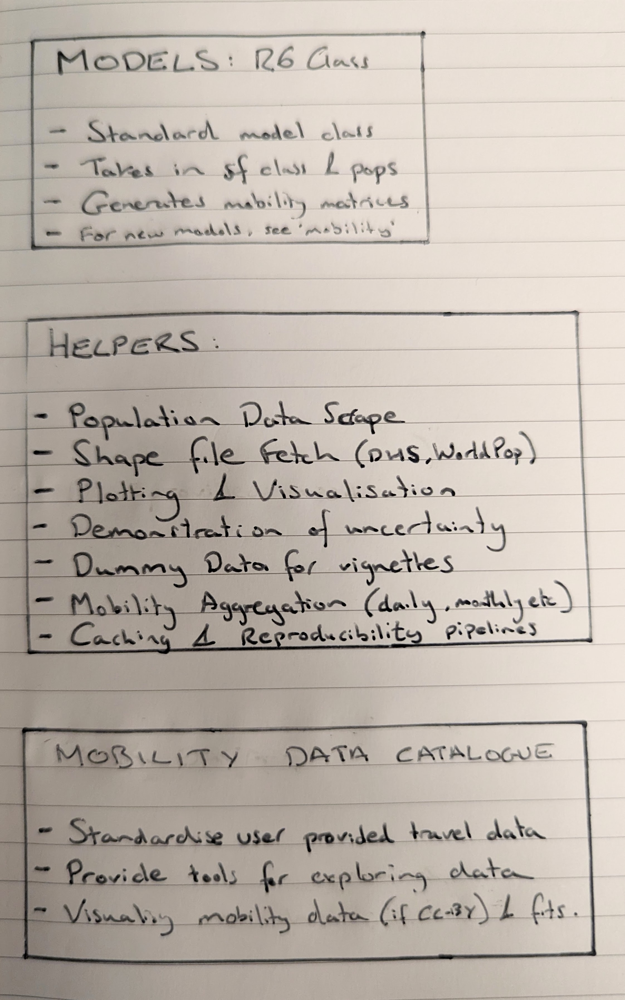

```{r, include = FALSE}
knitr::opts_chunk$set(
  collapse = TRUE,
  comment = "#>"
)
```

## Structure

This is an overall structure of the `nomad` package, which details the 
different components (models, underlying data, population hepers etc). 

The package components are shown below:


### 1. Models

The main workhorse is an `R6` mobility model class. This class will store 
mobility models, which will include the same functionality of the `mobility` model
(prediction to new data, use for destination probability prediction etc), 
while providing additional functionality to help users:

1. Show the model performance against the data used in fitting
2. Descriptions of the model type
3. Description of the data set used in fitting (links to data catalogue)
4. Reproducibility caching for stochastic draws

Models are stored in `nomad` for users to apply for their own research need. To 
help users identify the best model for their needs, `nomad` also maintains
a data catalogue of the different mobility data sets that have been used in 
producing the `mobility` models available in nomad. 

### 2. Data Catalogue

The data catalgoue will be a structure data set (format undecided as yet) for 
storing meta data about each mobility data set that has been used to create 
mobility models. The meta data (mobility data survey size, sampling scheme, 
respondent characteristics, location, associated publication etc) will help guide 
users to understand which data source seems most suitable for their use case. 

For example, end users may want to choose mobility models that have been fit
using data from the same country as their analysis, or may want to select based 
on mobility data type (flight data, travel surveys etc). To facilitate this need, 
`nomad` provides functionality to query and visualise mobility data:

1. Maps of data locations
2. Visualisations of survey sizes
3. ...

Once users have identified suitable data sets, they can identify the associated
model objects for fits to these data sets. 

### 3. Helper Functions

End users are likely to approach `nomad` with their own location data (lat/long, 
shape files, distance matrices etc) and possibly linked population data. To help
users get their data into a format needed for `mobility` models as well as to 
help provide interpretation and reproducibility for their analyses, we provide 
series of helper functions in nomad:

1. API tools for population data sets (WorldPop)
2. Conversion from population rasters to shape files
3. Plotting and visualisation of outputs from mobility models

Lastly, provide suppoting vignettes and guides to give demonstration of full 
functionality, relationship to the `mobility` package as well as how users with
their own mobility data can use `mobility` to fit mobility models and how to 
integrate these with `nomad` either by submitting new PRs, or by converting
their mobility model into one that can leverate `nomad` functionality. 
